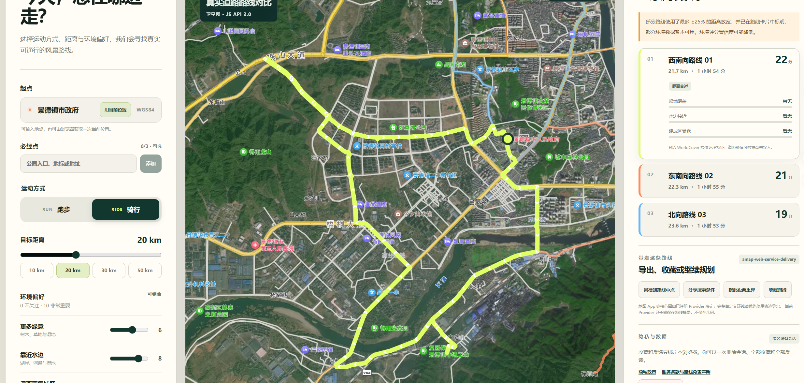

# 找路

**中文** | [English](README_EN.md)

找路是一个面向跑步和骑行场景的风景路线推荐项目。

项目目标不是重做底层路线引擎，而是在地图服务提供的真实可通行道路上，结合环境特征、用户偏好和路线多样性，推荐距离合适且风景更好的路线。

[](https://github.com/Harvey-015/zhaolu-route-finder/actions/workflows/ci.yml)
[](LICENSE)

## 在线演示

[打开 Cloudflare 公网演示站](https://zhaolu-route-finder.wuchunkai55.workers.dev)

[](https://zhaolu-route-finder.wuchunkai55.workers.dev)

演示站默认按景德镇区域优化地点排序，仍允许搜索其他城市；路线、卫星底图与环境数据
分别受高德和 ESA WorldCover 的可用性、额度与许可约束。

## 当前状态

当前仓库已经具备可运行、可测试和可部署的完整路线推荐链路：

- 与地图供应商无关的地点、路线、环境特征和评分模型；
- WGS-84 与 GCJ-02 类型边界；
- `findScenicRoutes` 应用用例；
- 可替换的地点、路线、环境和评分端口；
- 可替换的候选生成、评分与路线选择纯策略，以及版本化算法 Profile 注册表；
- Fake Provider 和完全离线的核心测试；
- 调用预算、并发、取消、降级和稳定错误契约。
- 高德地点解析与步行、骑行路线 Adapter；
- 高德 DTO、运行时校验和内部模型 Mapper；
- 集中的 GCJ-02/WGS-84 转换；
- 集中的超时、有限重试、取消、额度和错误转换；
- 途经点路段拆分、调用上限和路线合并；
- 高德离线契约测试和受控在线冒烟；
- ESA WorldCover COG 环境特征 Adapter 和受控在线冒烟；
- 版本化 Server API、OpenAPI、健康检查和本地 HTTP 冒烟；
- React Web UI、当前位置、最多三个必经点、路线条件和结果比较；
- 必经点按用户顺序进入真实道路规划，并对最终几何进行 80 米内的逐点复核；
- 目标距离优先控制在 ±15%，必要时最多放宽到 ±25%，超过边界的路线不会进入结果；
- 本地生成 12 个方向候选；有必经点时为北、东、南、西保留在线规划名额和备用候选；
- 路线方向根据高德返回的真实几何计算，环境偏好同时影响候选引导和最终评分；
- 可注入 `BasemapRenderer` 与独立的 `MapLayerProvider` 注册表；
- 高德 JS API 2.0 默认卫星图 + 路网、标准图切换、服务端安全密钥代理和无 Key SVG 降级；
- 桌面和移动端浏览器验收；
- 注册式 `RouteExporter`、`NavigationLinkProvider`，以及受 Provider
  policy 控制的 GPX、GeoJSON 和高德 URI 路线交付；
- Provider policy 控制的路线持久化与过期策略；
- 匿名签名会话、可替换的用户数据端口、SQLite/D1 收藏和现场反馈；
- 共享搜索条件和按路线实际距离重新规划；
- 单进程生产运行时、Docker/Compose 和 GitHub Actions；
- 启动配置校验、限流、探针、指标、脱敏日志和优雅关闭；
- SQLite 在线备份、自动恢复验证和 Prometheus 告警规则；
- 多城市实网验收、受控压测、静态 Secret 扫描和生产依赖审计；
- 覆盖核心、Provider、API、持久化和 Web 客户端的完整自动化测试集（当前 135 项）。

服务端 Key 和会话签名 Secret 只通过环境变量注入，仓库不包含任何真实 Secret。
仓库同时提供 Cloudflare Workers + D1 和 Node.js + SQLite 两种运行方式。公网部署仍需
由运营者配置域名白名单、Provider Secret、配额与合规信息；真实 Secret 不进入 Git。

## 架构边界

```text
调用方
  ↓
findScenicRoutes
  ├─ PlaceProvider
  ├─ RouteProvider
  ├─ SceneryProvider
  ├─ RouteScoringPolicy
  ├─ CandidateGenerationStrategy
  └─ RouteSelectionStrategy
```

默认产品组合为：高德 JS API 地图渲染、高德卫星/标准底图、高德 POI 与路线规划、
ESA WorldCover 环境分析、`scenic-route@2` 推荐算法，以及高德导航交接。地图渲染器、
可见底图/参考图层、地点与道路 Provider、环境数据 Provider、推荐算法 Profile 和路线
交付 Provider 均在组合根注册，可以分别替换，不要求修改路线核心或页面条件分支。

核心代码只依赖内部 TypeScript 模型，不依赖 React、Next.js、Cloudflare、数据库或第三方地图 SDK。

高德基础设施代码位于 `src/adapters/amap`，实现 `PlaceProvider`、`RouteProvider`
和高德导航交接；这些实现不会反向进入路线核心。

完整设计见 [架构文档](docs/ARCHITECTURE.md)。
Web 本地运行方式见 [Web UI 文档](docs/WEB_UI.md)，Server API 见
[接口文档](docs/SERVER_API.md)，路线交付和数据策略见
[路线交付文档](docs/ROUTE_DELIVERY.md)，Provider 授权门禁见
[合规决策记录](docs/PROVIDER_COMPLIANCE.md)，生产运行见
[部署文档](docs/DEPLOYMENT.md)，预发布实网验收见
[预发布文档](docs/STAGING.md)，隐私、条款与数据权利见
[隐私与条款文档](docs/PRIVACY_AND_TERMS.md)，监控、告警和恢复见
[运行保障文档](docs/OPERATIONS.md)，上线质量门禁见
[发布门禁文档](docs/RELEASE_GATES.md)，最终 Go/No-Go 流程见
[发布清单](docs/LAUNCH_CHECKLIST.md)。

## 开发命令

```bash
pnpm install
pnpm run typecheck
pnpm run test
pnpm run build
pnpm exec playwright install chromium
pnpm run test:e2e
```

`test:e2e` 会启动本地 Fixture API 与 Vite，并用 Chromium 验证路线生成、
收藏和刷新恢复主流程；CI 会自动安装对应浏览器。

## 本地体验完整版本

准备好 `.env` 中的高德 Key 和至少 32 字符的会话密钥后，在 PowerShell 中运行：

```powershell
pnpm run build
$env:ZHAOLU_PUBLIC_ORIGIN = "http://127.0.0.1:8787"
node --env-file=.env dist/runtime/main.js
```

然后访问 `http://127.0.0.1:8787`。该地址同时提供网页、Server API 和高德安全代理，
因此测试到的是完整路线算法，而不是静态界面预览。

Cloudflare Workers + D1 的公网部署与 Secret 配置见
[Cloudflare 部署文档](docs/CLOUDFLARE_DEPLOYMENT.md)。

## 参与开发

欢迎提交缺陷修复、测试、文档，以及新的地图、路线、环境数据和推荐算法实现。开始前请阅读：

- [贡献指南](CONTRIBUTING.md)
- [社区行为准则](CODE_OF_CONDUCT.md)
- [安全策略](SECURITY.md)
- [支持范围](SUPPORT.md)
- [项目治理](GOVERNANCE.md)
- [公开路线图](ROADMAP.md)
- [变更记录](CHANGELOG.md)
- [开放源代码发布清单](docs/OPEN_SOURCE_RELEASE.md)
- [Cloudflare Workers + D1 演示站部署（R2 可选）](docs/CLOUDFLARE_DEPLOYMENT.md)

新增能力时保持现有解耦边界：第三方 DTO、SDK 和网络调用留在 Adapter；核心只依赖内部模型和端口；Provider、地图图层和算法 Profile 通过组合根或注册表接入。较大的扩展先使用仓库中的 Provider Issue 模板讨论坐标系、许可证、额度、缓存和降级策略。

## 许可证

项目采用 [Apache License 2.0](LICENSE) 开源。第三方地图、卫星影像、路线和环境数据仍分别受对应 Provider 条款与数据许可证约束；代码许可证不替代这些授权。
