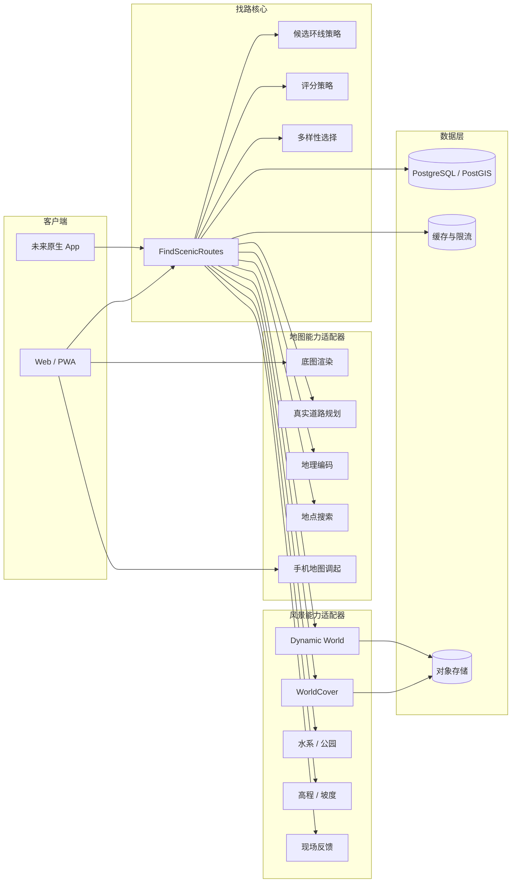
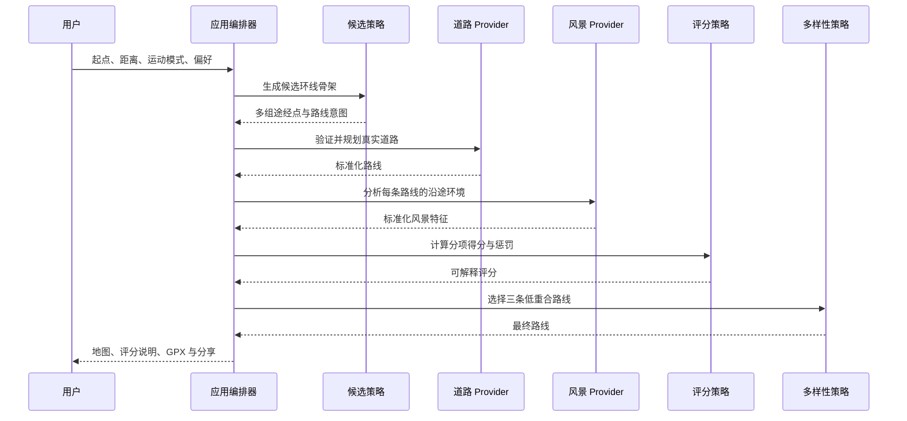
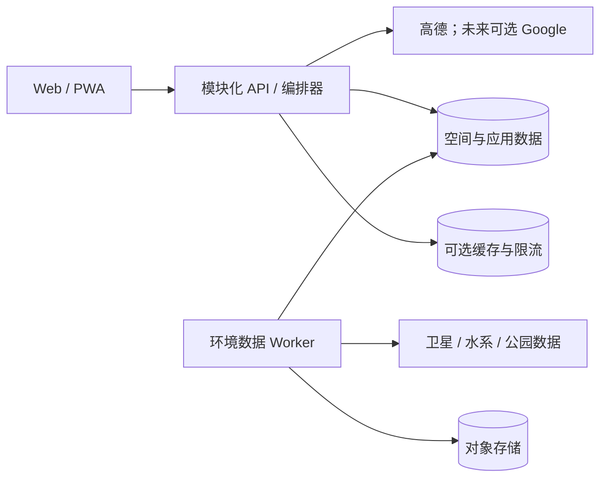

# 找路：整体架构

## 1. 产品定位

找路是一个面向跑步和骑行的风景路线发现系统。

它不重做底层路线引擎，而是在地图服务商提供的真实可通行道路上：

1. 生成多个闭环路线意图；
2. 调用地图路线服务将意图落实为真实道路；
3. 使用卫星、土地覆盖、水系、绿地、高程和现场反馈描述沿途环境；
4. 按用户偏好计算可解释的风景与舒适度评分；
5. 选出三条风景较好且实际道路差异明显的路线；
6. 通过网页、手机地图和 GPX 交付路线。

当前地图与道路服务商是高德。未来可以按能力接入 Google Maps 或其他服务商，但不会因此重写候选生成、风景分析和评分逻辑。

### 1.1 当前实现范围

当前仓库是正式版本的模块化核心，不包含旧产品原型。已经实现内部标准模型、坐标类型、核心用例、最小 Provider 端口、候选与选择策略、Fake Provider 和离线测试。

第二阶段已经增加高德地点和路线 Adapter、DTO Mapper、GCJ-02/WGS-84 转换、集中 HTTP 策略和离线契约测试。真实高德 Key、在线冒烟测试、WorldCover、Worker API、React 展示层、数据库、收藏、分享和部署仍不在当前实现范围。

## 2. 架构原则

### 2.1 稳定核心与可变实现分离

稳定核心包括：

- 路线搜索请求；
- 标准路线、地点和坐标模型；
- “候选生成 → 真实道路 → 风景分析 → 评分 → 多样性选择”流程；
- 可解释的评分结果；
- Provider 能力和政策信息。

可变实现包括：

- 地图渲染；
- 地点搜索与地理编码；
- 道路路线服务；
- 候选环线算法；
- 风景数据源；
- 评分公式；
- 路线相似度算法；
- GPX、手机地图和分享方式；
- 缓存与持久化实现。

### 2.2 按能力抽象，不按厂商抽象

不设计一个包含所有功能的巨大 `MapProvider`。底图、路线、搜索和手机调起是相互独立的能力：

```text
地图服务能力
├─ BasemapRenderer
├─ RoutingProvider
├─ GeocodingProvider
├─ PlaceSearchProvider
├─ NavigationLinkProvider
└─ ProviderPolicy
```

同一运行区域可以使用一套能力组合，也可以在政策允许时组合不同来源。

### 2.3 核心不依赖 SDK 和框架

核心业务不能直接依赖：

- 高德或 Google SDK；
- React 或地图组件；
- HTTP 请求库；
- 数据库客户端；
- GeoTIFF、GDAL 等数据处理库。

这些依赖只能出现在 Adapter 中，并通过 Port 接口被核心调用。

### 2.4 模块化单体优先

代码按边界拆分，但早期不把每个模块部署成微服务。在线应用保持一个 API/编排服务；环境数据处理可以作为独立 Worker。只有某个模块需要独立扩容、运行时或资源配置时，才拆成服务。

## 3. 系统全景



## 4. 核心路线流水线



核心用例只负责编排。候选生成、评分和最终选择由组装位置注入，应用用例不直接 import 具体算法：

```ts
findScenicRoutes(request, {
  placeProvider,
  routeProvider,
  sceneryProvider,
  scoringPolicy,
  candidateGenerationStrategy,
  routeSelectionStrategy,
});
```

这里不能出现 `if (provider === "amap")` 或 `if (source === "worldcover")`。

## 5. 可替换模块

### 5.1 候选环线策略

候选策略提出路线意图，不判断道路是否真实可走。

```ts
type CandidateGenerationStrategy = (
  input: CandidateGenerationInput,
) => readonly RouteCandidate[];
```

候选策略必须是同步纯函数，只使用标准领域模型，不调用地图、环境或数据库服务。首批实现：

- `DirectionalLoopStrategy`：不同方位的基础闭环；
- `WaterfrontLoopStrategy`：经过亲水候选走廊；
- `GreenCorridorStrategy`：经过绿地或公园；
- `RequiredWaypointStrategy`：按顺序包含用户必经地点。

以后可以加入地标串联、低坡度或夜跑照明策略，而不修改道路 Provider。

### 5.2 道路规划 Provider

```ts
interface RoutingProvider {
  readonly id: string;
  capabilities(): RoutingCapabilities;
  materialize(
    skeletons: RouteSkeleton[],
    mode: TravelMode,
  ): Promise<NormalizedRoute[]>;
}
```

当前实现：

- `AmapRoutingProvider`

未来可能实现：

- `GoogleRoutingProvider`
- 其他区域地图或路线服务

道路 Provider 负责：

- Provider 请求与鉴权；
- 出行方式和途经点映射；
- 坐标转换；
- 分段路线合并；
- 重试、超时和限额；
- 将厂商响应转换为 `NormalizedRoute`；
- 附带数据来源、归属和展示限制。

它不负责风景分析和最终路线选择。

### 5.3 地图展示 Renderer

```ts
interface BasemapRenderer {
  mount(
    container: HTMLElement,
    options: MapOptions,
  ): Promise<MapController>;
}
```

实现可以是：

- `AmapBasemapRenderer`
- `GoogleBasemapRenderer`
- `MapLibreBasemapRenderer`

地图组件只接收标准路线和覆盖物。路线计算不能放进地图组件。

### 5.4 地点与地理编码

```ts
interface PlaceSearchProvider {
  search(query: string, context: SearchContext): Promise<NormalizedPlace[]>;
}

interface GeocodingProvider {
  geocode(input: GeocodingInput): Promise<NormalizedPlace[]>;
  reverse(point: Wgs84Point): Promise<NormalizedPlace[]>;
}
```

Provider ID 必须保留：

```ts
type ProviderPlaceRef = {
  provider: string;
  id: string;
};
```

高德 POI ID、Google Place ID 和自己的地点 ID 不能混用。

### 5.5 风景特征 Provider

```ts
interface ScenicFeatureProvider {
  readonly id: string;
  analyze(
    route: NormalizedRoute,
    context: AnalysisContext,
  ): Promise<Partial<ScenicFeatures>>;
}
```

标准特征示例：

```ts
type Metric = {
  value: number;
  coverage: number;
  confidence: number;
  source: string;
  sourceVersion: string;
  observedAt: string | null;
};

type ScenicFeatures = {
  greenCoverage: Metric | null;
  treeCoverage: Metric | null;
  waterfrontRatio: Metric | null;
  waterDistance: Metric | null;
  builtUpRatio: Metric | null;
  slopeComfort: Metric | null;
  majorRoadRatio: Metric | null;
  reportedRisk: Metric | null;
};
```

WorldCover 只提供土地覆盖特征，不直接决定最终得分。未来叠加 Dynamic World 或城市绿地数据时，只增加 Provider 或更换特征聚合器。

### 5.6 评分策略

```ts
interface RouteScoringPolicy {
  readonly id: string;
  readonly version: string;
  score(
    route: EnrichedRoute,
    preferences: ScenicPreferences,
  ): ScoreBreakdown;
}
```

评分必须是纯函数，不联网、不读取数据库、不依赖 UI。

```ts
type ScoreBreakdown = {
  total: number;
  dimensions: {
    greenery: number;
    waterfront: number;
    comfort: number;
    safety: number;
    loopQuality: number;
  };
  penalties: {
    distanceError: number;
    retrace: number;
    majorRoad: number;
  };
  version: string;
};
```

不同评分版本可以并存：

- `ScenicScoreV1`
- `RunningScoreV1`
- `CyclingScoreV1`

历史路线保存评分版本和数据源版本，保证结果可解释、可复现。

如果未来评分依赖远程机器学习服务，不把 `fetch` 放入纯评分策略。届时新增异步 `RouteScoringProvider`，由 Adapter 负责超时、取消、额度和第三方 DTO 转换；本地或已加载模型仍可继续实现纯 `RouteScoringPolicy`。

### 5.7 多样性选择

```ts
type RouteSelectionStrategy = (
  input: RouteSelectionInput,
) => readonly RecommendedRoute[];
```

负责：

- 方向差异；
- 道路重合率；
- 原路折返；
- 路线形状相似度；
- 三条路线的空间覆盖差异。

推荐使用：

```text
下一条路线的选择价值
= 路线风景与舒适度得分
- 与已选路线的最大重合率 × 惩罚系数
```

### 5.8 输出与手机交接

```ts
interface RouteExporter {
  export(route: ScenicRoute): Promise<ExportResult>;
}

interface NavigationLinkProvider {
  createLink(route: ScenicRoute, context: NavigationContext): Promise<string>;
}
```

实现包括：

- `GpxExporter`
- `GeoJsonExporter`
- `AmapNavigationLinkProvider`
- `GoogleNavigationLinkProvider`
- 系统分享

完整自定义轨迹以找路手机页和 GPX 为准。地图 App 调起属于 Provider 能力，不应修改核心路线。

## 6. 地图 Provider 组合

Provider Registry 在应用启动时组装能力：

```ts
type ProviderProfile = {
  basemap: BasemapRenderer;
  routing: RoutingProvider;
  geocoding: GeocodingProvider;
  places: PlaceSearchProvider;
  navigation: NavigationLinkProvider;
  policy: ProviderPolicy;
};
```

初始配置：

```text
china
├─ basemap: AMap
├─ routing: AMap
├─ geocoding: AMap
├─ places: AMap
└─ navigation: AMap
```

未来配置：

```text
global
├─ basemap: Google
├─ routing: Google
├─ geocoding: Google
├─ places: Google
└─ navigation: Google
```

由 `ProviderSelector` 根据地点区域、用户选择、能力、健康状态、额度和 Provider 政策选择 Profile。核心流程不关心实际厂商。

不要默认允许任意混合“厂商 A 的路线数据 + 厂商 B 的底图”。`ProviderPolicy` 必须记录：

- 必需的底图；
- 归属信息；
- 缓存期限；
- 是否允许持久化；
- 是否允许导出；
- 地域限制。

## 7. 坐标模型

核心内部统一使用 WGS-84 / EPSG:4326。

```ts
type Wgs84Point = {
  lng: number;
  lat: number;
  crs: "EPSG:4326";
};

type Gcj02Point = {
  lng: number;
  lat: number;
  crs: "GCJ-02";
};
```

高德 Adapter 在边界执行：

```text
核心 WGS-84
→ 高德 Adapter 转 GCJ-02
→ 高德 API
→ 高德 Adapter 转 WGS-84
→ 核心
```

Google 或其他 Provider 按自己的坐标约定处理。业务层不得使用含义不明的裸 `[number, number]` 跨越模块。

PostGIS 中的长期 geometry 使用 SRID 4326。Provider 原始几何若需短期保存，字段名必须带 Provider 和坐标系。

## 8. 领域模型

### 8.1 搜索请求

```ts
type ScenicRouteRequest = {
  start: Wgs84Point;
  mode: "running" | "cycling";
  targetDistanceMeters: number;
  requiredPlaces: NormalizedPlace[];
  preferences: ScenicPreferences;
  providerProfile?: string;
};
```

### 8.2 标准路线

```ts
type NormalizedRoute = {
  id: string;
  geometry: GeoJSON.LineString;
  distanceMeters: number;
  durationSeconds: number | null;
  ascentMeters: number | null;
  mode: TravelMode;
  skeletonId: string;
  source: {
    provider: string;
    routeId?: string;
  };
  policy: ProviderPolicySnapshot;
  providerMetadata: Record<string, unknown>;
};
```

### 8.3 最终风景路线

```ts
type ScenicRoute = NormalizedRoute & {
  features: ScenicFeatures;
  score: ScoreBreakdown;
  direction: number;
  similarity: RouteSimilarity;
  dataVersions: string[];
};
```

未知值必须使用 `null`，不能用 `0` 伪装成“零爬升”或“零红绿灯”。

## 9. 代码目录目标

当前先保持一个轻量 TypeScript 模块化单体。只有真实模块数量和独立发布需求增长后，才考虑拆成 workspace packages：

```text
src/
├─ route-recommendation/
│  ├─ models.ts
│  ├─ coordinates.ts
│  ├─ errors.ts
│  ├─ ports.ts
│  ├─ strategies.ts
│  ├─ candidateGeneration.ts
│  ├─ diversity.ts
│  ├─ findScenicRoutes.ts
│  └─ fakes.ts
└─ adapters/
   └─ amap/
      ├─ coordinates.ts
      ├─ dto.ts
      ├─ errors.ts
      ├─ httpClient.ts
      ├─ mappers.ts
      ├─ placeProvider.ts
      └─ routeProvider.ts

tests/
├─ route-recommendation-core.test.ts
├─ amap-adapters.test.ts
├─ fixtures/amap/
└─ types/

docs/
└─ ARCHITECTURE.md
```

未来增加 Web、Worker 和 Provider Adapter 时，在保持核心依赖方向不变的前提下增加顶层模块，不提前拆微服务或多 package。

## 10. 运行与部署

第一阶段只需要三个运行单元：



### Web / PWA

负责：

- 搜索条件与偏好；
- 地图展示；
- 候选路线比较；
- 评分解释；
- GPX 和手机分享。

浏览器可以加载地图 JS SDK，但不直接调用服务端路线、地理编码或地点搜索密钥。

### API / 编排器

负责：

- Provider 选择；
- 路线搜索用例；
- 外部服务密钥；
- 配额、重试、超时和降级；
- 环境特征查询；
- 评分和多样性选择；
- 收藏、分享和短期结果。

### 环境数据 Worker

负责：

- 读取 COG、STAC、矢量水系或开放数据；
- 预处理绿地、水体、高程和数据版本；
- 写入空间数据库或对象存储。

第一版仍可在线读取 WorldCover，但必须藏在 `WorldCoverProvider` 后面。以后替换为预计算数据库查询时，不修改路线核心。

### 数据层

按需要使用：

- PostgreSQL/PostGIS：路线、空间特征、收藏和现场反馈；
- 缓存：限流、短期搜索结果和 Provider 配额；
- 对象存储：原始或处理后的环境数据、瓦片和可选导出文件。

早期不需要为每个模块部署微服务，也不需要自建路线引擎。

## 11. 数据与持久化

建议的长期实体：

```text
users
user_preferences
search_jobs
route_candidates
saved_routes
environment_sources
environment_cells
field_reports
score_versions
provider_usage
```

路线候选至少保存：

```text
geometry
provider
distance_m
duration_s
score_total
score_breakdown
score_version
data_versions
policy_snapshot
expires_at
```

搜索请求和未收藏路线默认短期保存。只有用户明确收藏后，路线才进入长期数据。所有 Provider 数据的保存必须服从对应政策快照。

## 12. 测试边界

### Core 单元测试

- 不访问网络；
- 不加载地图 SDK；
- 使用固定路线和特征测试评分；
- 使用固定候选测试多样性选择。

### Provider 契约测试

每个 Provider 共享同一套契约：

- 返回合法标准坐标；
- 距离和几何有效；
- 能力声明与实际行为一致；
- 错误转换为统一错误类型；
- Provider 政策和归属不丢失。

### 集成测试

- 使用录制或人工构造的 Provider 响应；
- 测试高德坐标转换和路线分段合并；
- 测试 WorldCover 覆盖率和缺失数据；
- 测试完整的找路流程但不消耗真实配额。

### 少量在线冒烟测试

仅在受控环境执行，用于确认：

- Provider 密钥和权限；
- 上游 API 结构没有变化；
- 地图脚本能够加载；
- 配额保护正常。

## 13. 依赖规则

必须遵守：

1. UI 不直接规划路线。
2. UI 不计算风景分。
3. 道路 Provider 不读取风景数据。
4. 风景 Provider 不决定最终选哪条路线。
5. 候选策略不判断道路是否可走。
6. 评分策略不联网、不读数据库。
7. 核心层不依赖地图 SDK、数据库或 Web 框架。
8. Provider 原始数据进入核心前必须标准化。
9. 坐标转换只发生在明确的 Provider 边界。
10. 路线数据始终携带来源、版本与政策信息。

依赖方向：

```text
Presentation → Use Cases → Ports
Adapters ─────────────────→ Ports
Core 不反向依赖 Adapters
```

## 14. 分阶段落地

### 阶段一：核心架构（已完成）

- 建立标准 Route、Place、Coordinate、Feature、Score 类型；
- 建立 `findScenicRoutes` 用例与最小 Provider 端口；
- 注入 Candidate、Score、Selection 策略；
- 增加 Fake Provider、预算、取消、降级和错误契约测试。

### 阶段二：高德 Adapter（离线实现已完成）

- 已增加高德地点与路线 DTO；
- 已在 Adapter 边界完成 GCJ-02/WGS-84 转换；
- 已将高德响应映射为内部模型；
- 已增加 Mapper fixture 和 Provider 契约测试；
- 已集中处理超时、有限重试、取消、额度和稳定错误；
- 已对不支持途经点的骑步行接口实施有上限的顺序分段和路线合并；
- 待使用服务端 Key 做受控在线冒烟测试；
- Worker/API 组装留到对应运行时阶段，不修改核心算法。

### 阶段三：环境数据 Adapter

- 增加 WorldCover Provider 和 DTO Mapper；
- 增加水系、公园、高程等 Provider；
- 将在线栅格读取替换为预计算特征；
- 展示路段级评分解释；
- 增加数据覆盖率和置信度。

### 阶段四：增加其他地图服务

- 增加 Google 或其他 Provider 的单项能力；
- 增加区域与能力选择；
- 验证展示、缓存和归属政策；
- 保持候选生成、风景特征和评分核心不变。

### 阶段五：社区与移动能力

- 增加原子化现场反馈；
- 增加过期与重复确认机制；
- 增加路线编辑、收藏和共享；
- 需要后台定位或离线导航时再开发原生 App。

## 15. 架构决策摘要

| 决策 | 选择 |
|---|---|
| 产品核心 | 风景路线发现，不自建底层路线引擎 |
| 初始地图 | 高德 |
| 未来地图 | 按能力增加 Google 或其他 Provider |
| 核心架构 | Ports and Adapters + Strategy + Pipeline |
| 部署形态 | 模块化单体 API + 环境数据 Worker |
| 内部坐标 | WGS-84 / EPSG:4326 |
| 风景数据 | 多 Provider 标准化特征 |
| 评分 | 纯函数、可版本化、可解释 |
| 三路线选择 | 风景得分与路线多样性分离 |
| 路线交付 | 找路网页 / PWA + GPX + 地图 App 调起 |
| 扩展方式 | 增加 Adapter 或 Strategy，不修改核心流程 |
